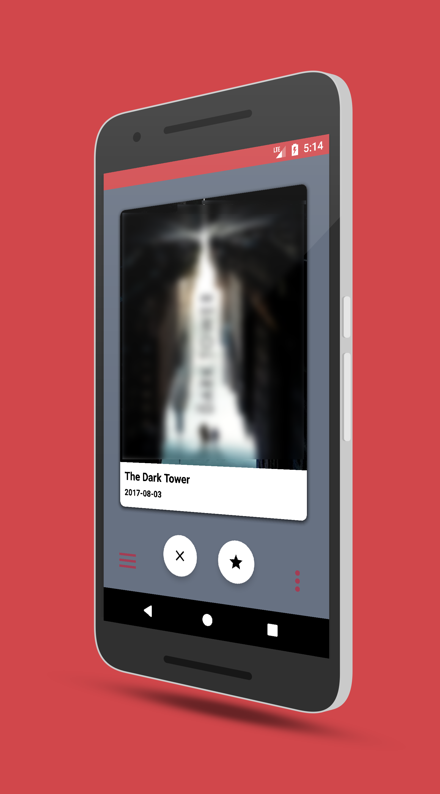
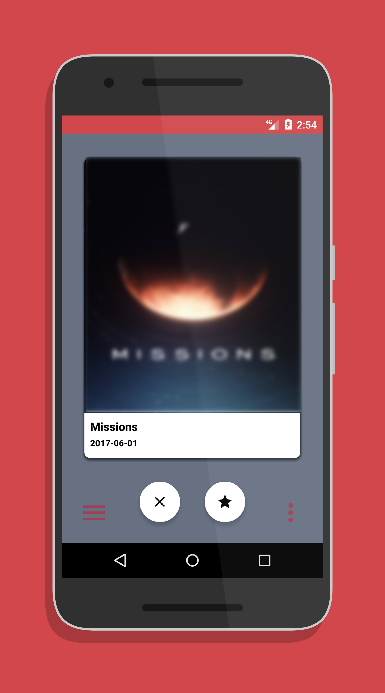
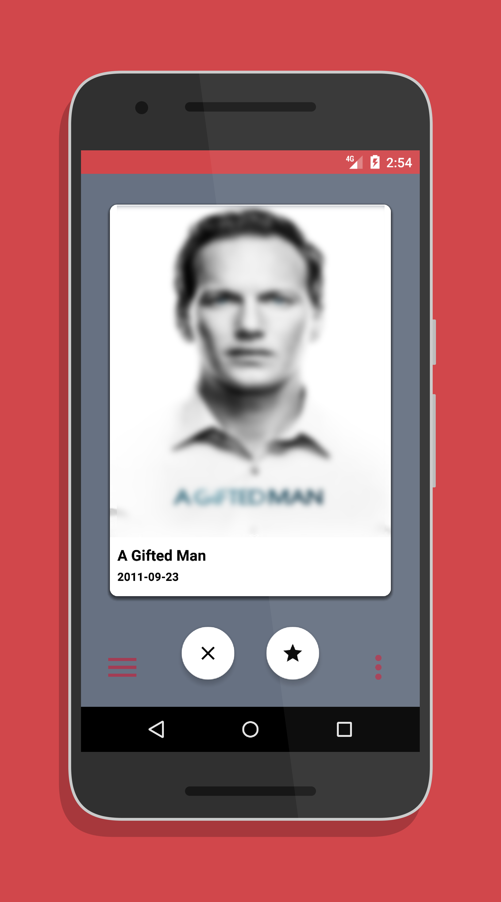

# Watch It! 

Movie/TV Series suggestions application, uses TheMovieDb API to fetch Movie/TV Series details. Tinder Like Cards and Gestures to Like/Dislike a particular Movie/TV Series. It also sends notifications to the User to remind them to Watch their Liked Movie/TV Series on Weekends. 

  
## Screenshots

## License

This project is licensed under the Apache License - see the [LICENSE.md](LICENSE.md) file for details
